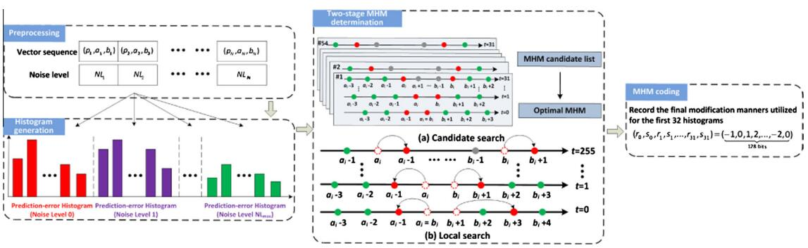
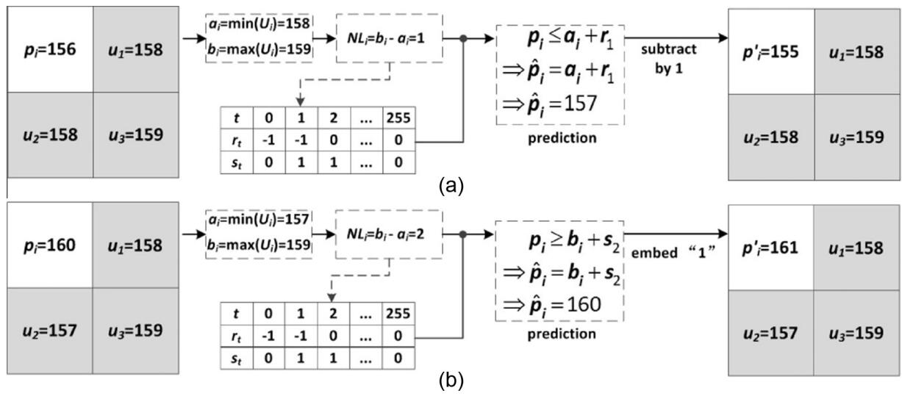
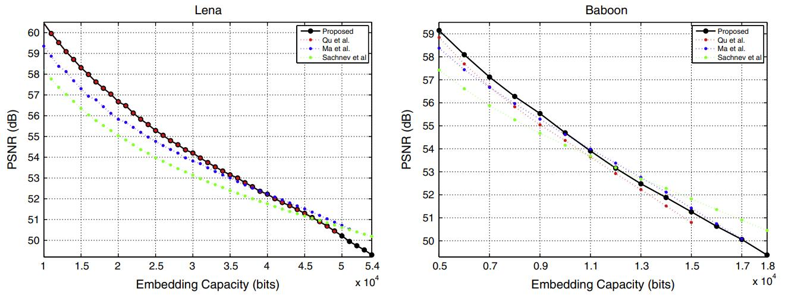
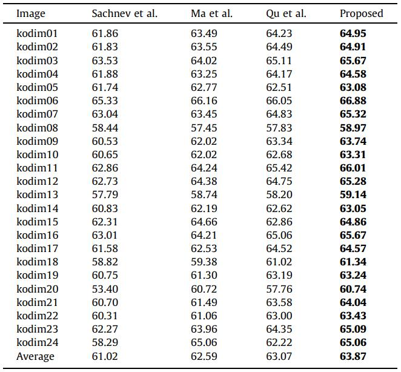

2016-Ou_MHM_PVO
=======


This repo is implementation for the accepted paper "[Improved PVO-based reversible data hiding: A new implementation based on multiple histograms modification](https://www.sciencedirect.com/science/article/pii/S1047320316300153)" (JVCIR 2016).


<p align="center">     </p>
<p align="center"> Figure 1: The overview of embedding process in the proposed method.</p>


<p align="center">     </p>
<p align="center"> Figure 2: Examples for the data embedding of MHM.</p>


## How to run

```
go to code
run mainADjustALL_2.m
```

## Experimental Results

<p align="center">     </p>
<p align="center"> Figure 3:  Performance evaluation in terms of capacity-distortion curve by comparing the proposed method with three methods.</p>

<p align="center">     </p>
<p align="center"> Figure 4:  Performance comparison in terms of PSNR (in dB) on Kodak image database for a capacity of 10,000 bits.</p>


## Environment
Matlab 2016b <br>


## Acknowledgement
This work is supported by the National Science Foundation of China (Nos. 61502160, 61232016, U1405254, and 61272421) and the PAPD fund.


## Citation
If you find this work useful for your research, please cite
```
@article{OU2016328,
title = {Improved PVO-based reversible data hiding: A new implementation based on multiple histograms modification},
journal = {Journal of Visual Communication and Image Representation},
volume = {38},
pages = {328-339},
year = {2016},
issn = {1047-3203},
doi = {https://doi.org/10.1016/j.jvcir.2016.03.011},
author = {Bo Ou and Xiaolong Li and Jinwei Wang},
}
```

## License and Copyright
The project is open source under MIT license (see the ``` LICENSE ``` file).

